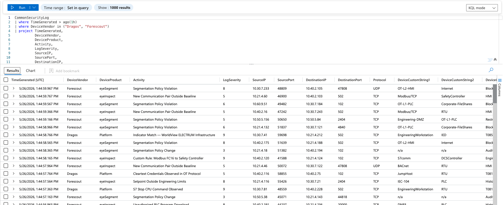
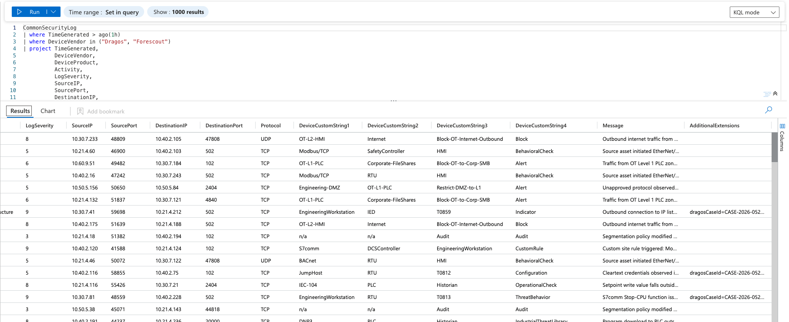
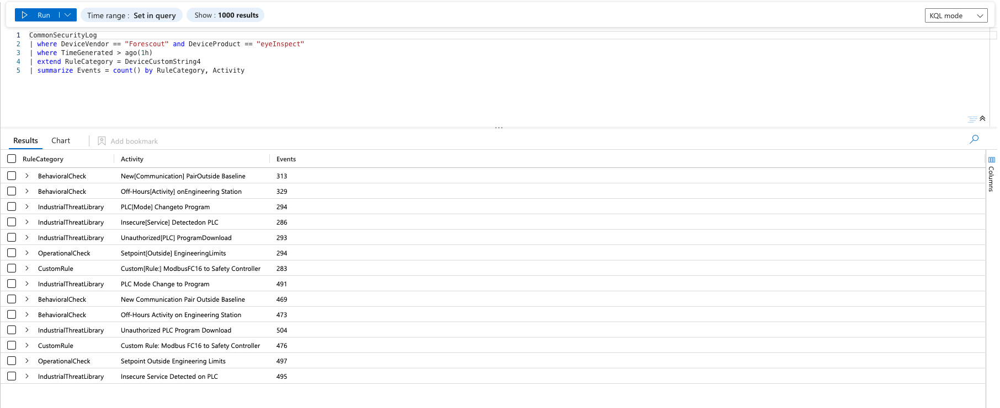
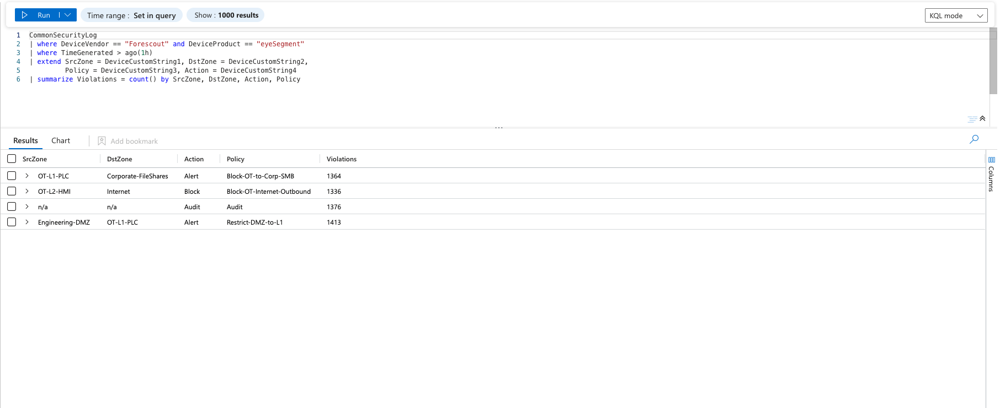
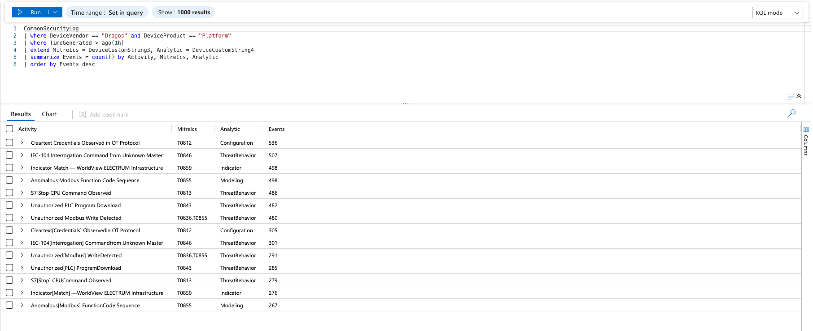
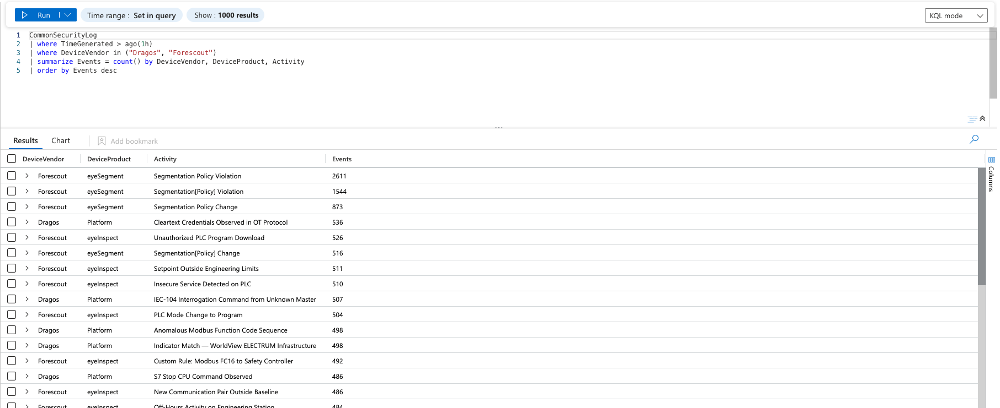

# Sentinel dashboard snapshots

These snapshots show the lab data after the generator has been ingested into Microsoft Sentinel's `CommonSecurityLog` table. They are useful as quick visual confirmation of the expected query shape, normalized fields, and summary views.

## Raw OT event flow

CommonSecurityLog results from Dragos and Forescout events over the last hour.

## Custom field mapping

The same event flow with the custom string fields visible. These fields carry OT-specific context such as zones, MITRE technique IDs, rule categories, and policy actions.

## Forescout eyeInspect rule summary

eyeInspect events grouped by rule category and activity.

## Forescout eyeSegment policy summary

eyeSegment policy violations grouped by source zone, destination zone, action, and policy.

## Dragos MITRE summary

Dragos Platform detections grouped by activity, MITRE ATT&CK for ICS technique, and analytic type.

## Vendor activity summary

Top generated activities by vendor and product.

