# SOAR incident workflow snapshots

These screenshots show the optional SOAR extension after Sentinel incidents have moved through enrichment, ticketing, and gated containment. Use them as a visual reference for what a working run should leave behind in the incident queue and what the human approver sees in email.

## Cross-Platform Correlation

This incident demonstrates the multi-sensor correlation path where Dragos and Forescout activity share an affected destination asset. The SOAR output shows response tags, ticketing evidence, enrichment fields, and the high-confidence incident details.

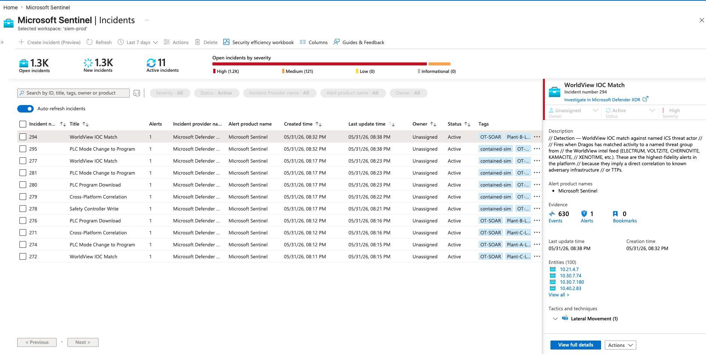

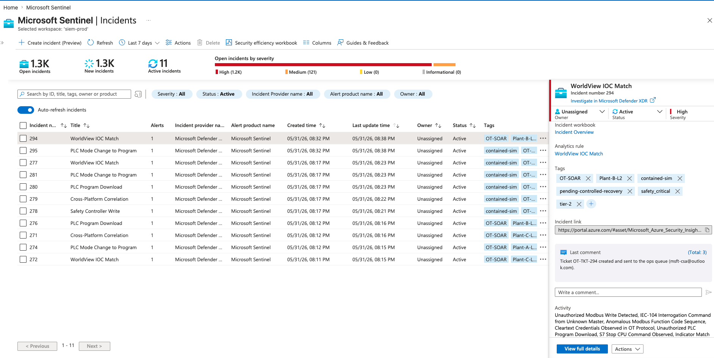

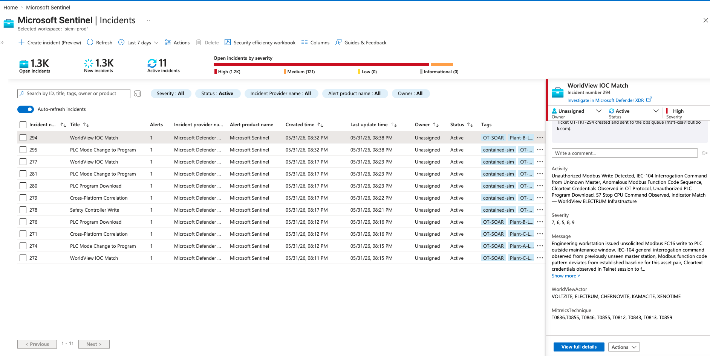

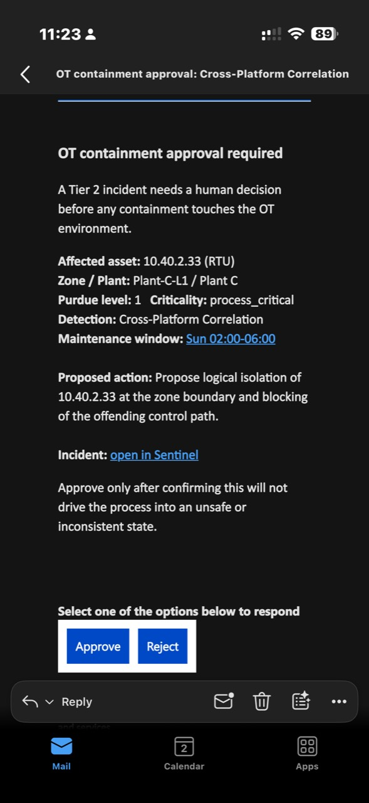

## PLC Mode Change to Program

This incident demonstrates a Tier 2 operational-impact detection. The expected result is a high-severity incident with enrichment tags, a ticketing comment, `tier-2`, `pending-controlled-recovery`, and `contained-sim` after approval-gated containment runs.

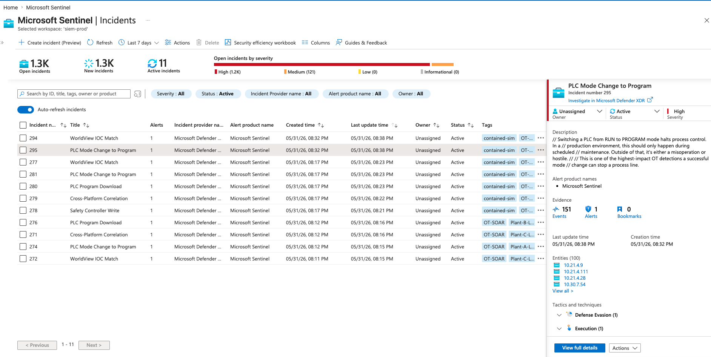

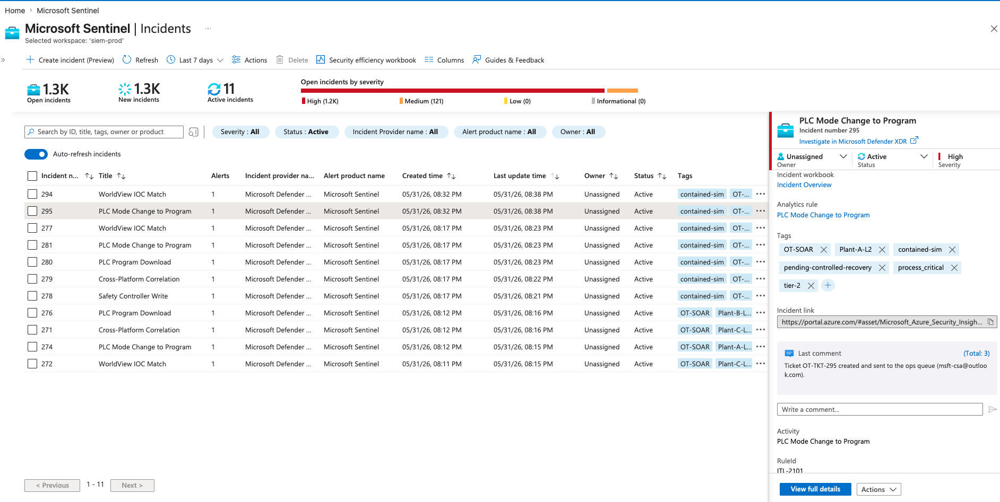

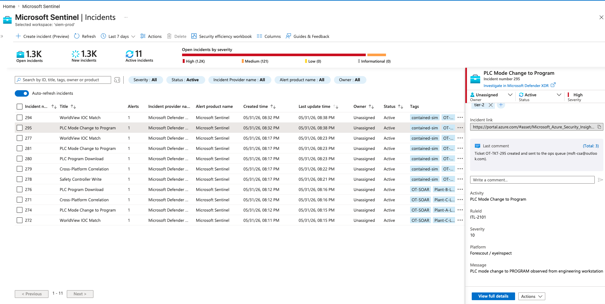

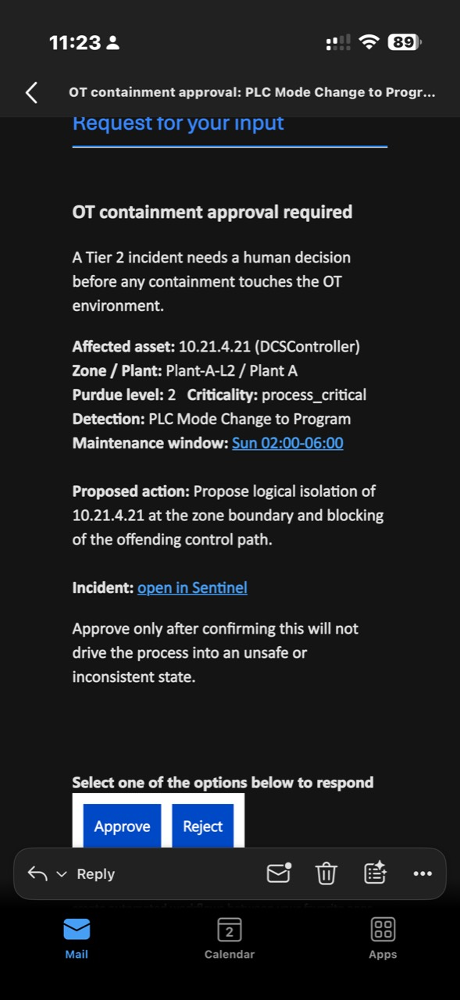

## WorldView IOC Match

This incident demonstrates the threat-intelligence path for Dragos WorldView matches. The screenshots show the ticket comment, safety-critical response context, enrichment tags, evidence count, affected entities, and analytics rule details.

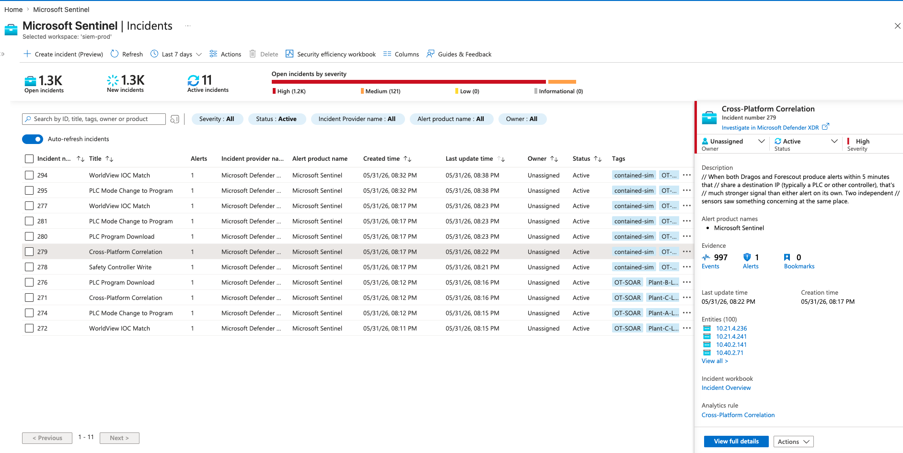

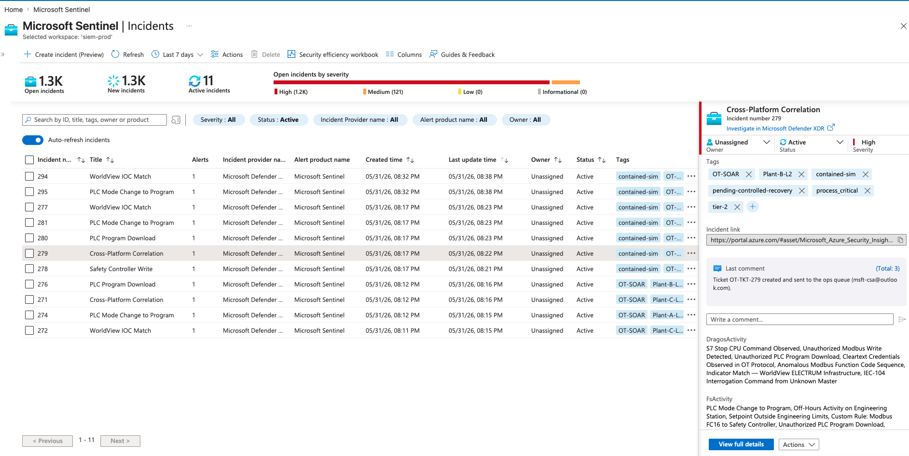

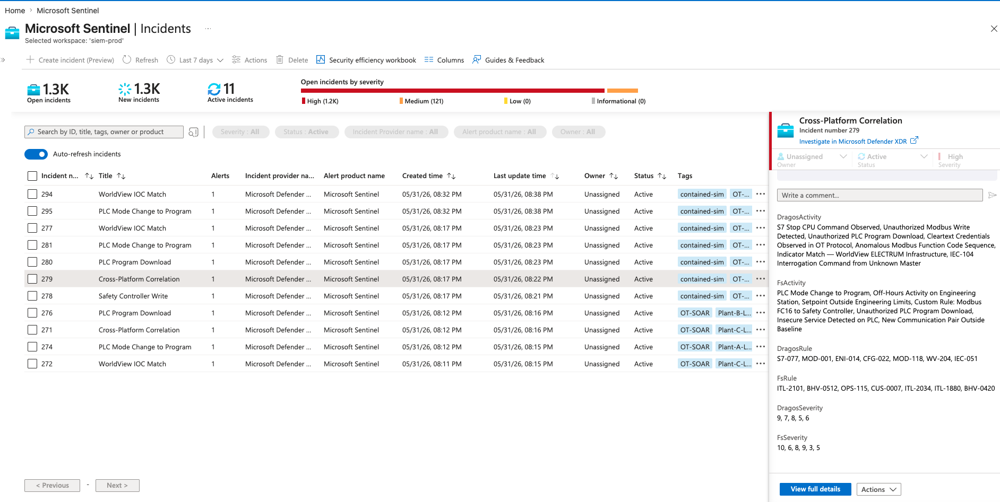

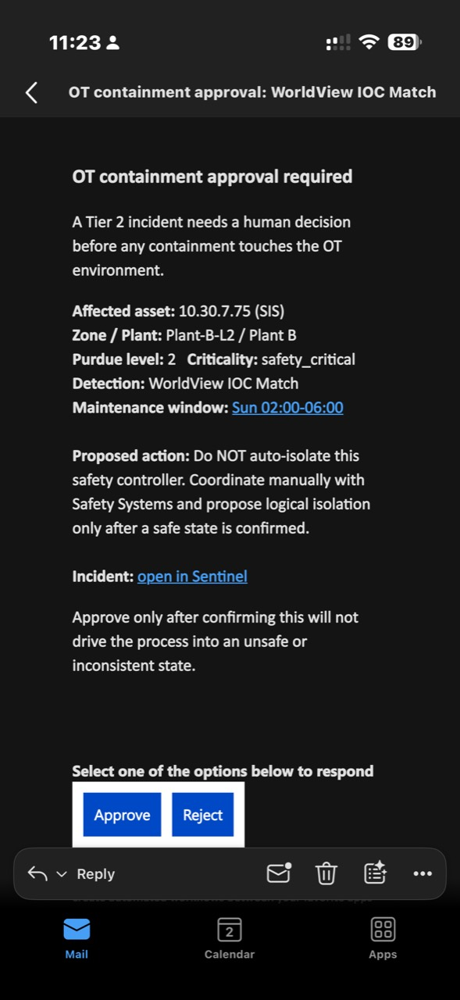
